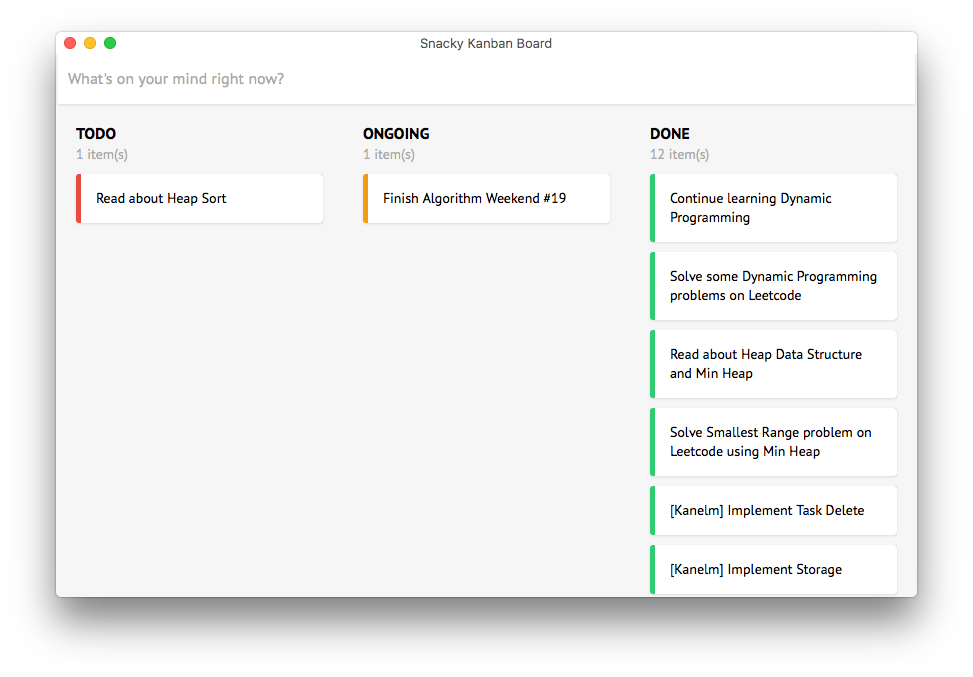

# Rust WebView demo



Build:

```
cargo build
```

Run:

```
cargo run
```

Want a desktop app for macOS? Use [appify](https://gist.github.com/mathiasbynens/674099)

```
cd target/release
appify <binary-file> <app-name>
```
